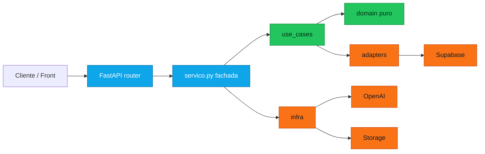

<div align="center">


<br />

<a href="#modo-90-segundos">
  
</a>
<a href="#stack">
  
</a>
<a href="#rodando-local">
  
</a>
<a href="#testes-e-qualidade">
  
</a>

<br />
<br />


<br />
<br />

<strong>Padoka 100</strong> e o backend de uma padaria pequena com ambicao grande:
operacao diaria simples por fora, dominio organizado por dentro, historico
preservado e IA entrando sempre como assistente, nunca como dona da verdade.

</div>

---

## Sumario

<table>
  <tr>
    <td><a href="#modo-90-segundos">Modo 90 segundos</a></td>
    <td><a href="#o-que-ele-resolve">O que ele resolve</a></td>
    <td><a href="#stack">Stack</a></td>
  </tr>
  <tr>
    <td><a href="#tour-do-produto">Tour do produto</a></td>
    <td><a href="#arquitetura">Arquitetura</a></td>
    <td><a href="#rodando-local">Rodando local</a></td>
  </tr>
  <tr>
    <td><a href="#mapa-da-api">Mapa da API</a></td>
    <td><a href="#testes-e-qualidade">Testes e qualidade</a></td>
    <td><a href="#deploy">Deploy</a></td>
  </tr>
</table>

---

## Modo 90 Segundos

```txt
Padoka 100
  -> cadastra produtos, fotos, locais e precos versionados
  -> abre o dia de venda, registra producao, venda, sobra e fechamento
  -> preserva snapshots: nome, imagem, preco e custo do momento
  -> calcula relatorios por dia, periodo e produto
  -> aceita comandos por texto/audio com confirmacao antes de gravar
  -> ajuda a montar custo real com texto, formulario, audio, imagem ou print
  -> isola cada conta por usuario_id vindo da sessao
  -> libera features por plano: basico, analitico, ia e admin
```

**Leitura recomendada:** se voce quer usar a API, va para
[Rodando local](#rodando-local). Se quer entender a cabeca do sistema, abra
[Arquitetura](#arquitetura). Se quer integrar front, pule para
[Mapa da API](#mapa-da-api).

---

## O Que Ele Resolve

Padaria pequena normalmente vive em uma mistura de caderno, memoria, foto de
balcao, conversa de WhatsApp e planilha que ninguem quer abrir no fim do dia.
Este backend transforma isso em fluxo:

| Dor real | Resposta do Padoka 100 |
| --- | --- |
| "Quanto vendemos hoje?" | Resumo do dia, vendas por produto e fechamento |
| "Esse preco mudou. E o passado?" | Precos versionados e snapshots nas vendas |
| "Sobrou produto ontem. Levo para hoje?" | Virada de dia com decisao explicita de sobra |
| "Foi vendido errado, mas o dia ja fechou." | Correcao retroativa com rastro estruturado |
| "Quanto custa produzir isso de verdade?" | Insumos, receitas, custos extras e calculo por unidade |
| "Tenho uma notinha/foto/audio, extrai isso pra mim." | Assistente de custeio com OpenAI, fallback e revisao |
| "Cada cliente precisa ver so os proprios dados." | Multiusuario por sessao, nao por payload |
| "Quero liberar recursos por plano." | Matriz de capacidades por plano e rota |

---

## Stack

| Camada | Tecnologia | Papel no projeto |
| --- | --- | --- |
| API | FastAPI | HTTP, OpenAPI, routers e dependencias |
| Linguagem | Python 3.12+ | Dominio, casos de uso, adapters e scripts |
| Config | pydantic-settings | `.env`, CORS, API prefix, chaves externas |
| Banco | Supabase Postgres | Persistencia principal e migrations SQL |
| Auth | Supabase Auth + sessao local | Bearer token, perfil local e transicao segura |
| Storage | Supabase Storage | Fotos de produto, perfil, midias e arquivos |
| IA | OpenAI | Comandos, audio, vision, analises e custeio assistido |
| Qualidade | pytest + ruff | Regressao de dominio, integracao fake e lint |
| Deploy | Railway / Render | Configuracoes prontas na raiz |

<details>
<summary><strong>Variaveis de ambiente</strong></summary>

```env
APP_NAME="Padoka 100 API"
APP_ENV="local"
API_PREFIX="/api/v1"
CORS_ORIGINS="http://localhost:3000,http://localhost:5173"
WEB_PRODUCTION_ORIGIN="https://padoka100-web-production.up.railway.app"
API_KEY=""

SUPABASE_URL=""
SUPABASE_KEY=""
SUPABASE_SERVICE_ROLE_KEY=""
SUPABASE_STORAGE_BUCKET="padoka-midia"

OPENAI_API_KEY=""
OPENAI_CHAT_MODEL=""
OPENAI_TEXT_MODEL="gpt-5.4-mini"
OPENAI_TRANSCRIPTION_MODEL="gpt-4o-transcribe"
```

Em producao, configure `API_KEY`, `SUPABASE_SERVICE_ROLE_KEY` e
`OPENAI_API_KEY` fora do repositorio.

</details>

---

## Tour Do Produto

<details open>
<summary><strong>1. Operacao de balcao</strong></summary>

- Catalogo com produto, preco vigente, imagem e historico.
- Locais de venda para separar retirada, balcao, feira ou entrega.
- Dia de venda com abertura, producao, venda manual, cancelamento e fechamento.
- Regra importante: produto so aparece na venda do dia se participou daquele dia.

</details>

<details>
<summary><strong>2. Historico que nao esquece</strong></summary>

O sistema salva snapshots no momento do fato. Se o preco muda na quinta, a venda
de segunda continua com o nome, imagem, preco e custo que existiam na segunda.

```txt
produto hoje
  nome: Pao de Queijo
  preco vigente: 10.00

venda antiga
  nome_snapshot: Pao de Queijo
  preco_unitario_snapshot: 8.00
```

</details>

<details>
<summary><strong>3. Multiusuario e planos</strong></summary>

Todo dado de negocio recebe `usuario_id` a partir da sessao autenticada. O
cliente nao manda dono no payload. Consultas por id filtram direto no banco e
registro de outra conta responde como nao encontrado.

Planos atuais:

| Plano | Libera |
| --- | --- |
| `basico` | perfil, notificacoes, catalogo, dias, vendas, relatorios basicos e midia |
| `analitico` | historico, relatorios avancados, compras e custos |
| `ia` | IA operacional, IA analitica e assistente de custeio |
| `admin` | usuarios, notificacoes admin, RAG e seed |

</details>

<details>
<summary><strong>4. IA com cinto de seguranca</strong></summary>

A IA interpreta comandos e ajuda em analises, mas a gravacao passa por
confirmacao e por casos de uso reais.

```txt
texto/audio/imagem
  -> interpretacao
  -> rascunho estruturado
  -> perguntas, avisos e pendencias
  -> confirmacao do usuario
  -> escrita no dominio
```

Quando OpenAI nao esta configurada, partes do sistema usam fallback local para
continuar testaveis e previsiveis.

</details>

<details>
<summary><strong>5. Custeio assistido</strong></summary>

O modulo de custos aceita insumos, receitas, custos adicionais, lista de compras
e uma sessao guiada para montar custo real de produto.

Entradas aceitas pelo assistente:

```txt
texto -> "usei 800g de farinha, pacote de 5kg saiu por 22 reais"
formulario -> dados estruturados do front
audio -> transcricao + interpretacao
imagem/print -> leitura por vision quando configurado
```

O backend simula custo, marca estimativas, mostra avisos de conversao e so grava
quando a sessao e confirmada.

</details>

<details>
<summary><strong>6. Notificacoes, RAG e admin</strong></summary>

- Feed de notificacoes por `todos`, `plano` ou `usuario`.
- Estado por usuario: lida, nao lida, oculta, expirada.
- Rotas admin para criar, publicar, arquivar, excluir e limpar expiradas.
- Base RAG administrativa para documentos internos.
- Seed de vendas fake para ambientes controlados.

</details>

---

## Arquitetura

O projeto passou por uma rearquitetura para tirar regra de negocio de arquivos
gigantes e mover logica testavel para `domain/` e `use_cases/`.



Regras de dependencia:

```txt
router -> servico -> use_cases -> domain
                  -> adapters/infra -> Supabase/OpenAI/Storage
```

- `domain/` nao importa FastAPI, Supabase ou OpenAI.
- `use_cases/` representa uma acao de negocio por arquivo.
- `adapters/` e `infra/` concentram efeitos externos.
- `public.py` e o contrato preferido entre modulos.
- `servico.py` ainda existe como fachada de compatibilidade enquanto os fluxos
  maiores terminam de ser fatiados.

<details>
<summary><strong>Mapa de pastas</strong></summary>

```txt
app/
  main.py                  # app FastAPI, CORS, health e routers
  api/router.py            # agrega os modulos
  core/                    # config, errors, security, clock
  infra/                   # clientes e helpers Supabase/OpenAI
  modules/
    produtos/              # catalogo, preco vigente, snapshots
    vendas/                # registro, listagem, cancelamento
    dias_de_venda/         # abertura, fechamento, sobras, correcoes
    relatorios/            # agregacao por dia e periodo
    custos/                # insumos, receitas, compras, assistente
    ia/                    # comandos, audio, analises e fallback
    auth/                  # usuarios, perfil, papeis, planos
    notificacoes/          # feed, leitura, admin
    midia/                 # uploads e propriedade
    historico/             # linha do tempo
    rag/                   # documentos admin
    admin/                 # seed operacional
supabase/migrations/       # SQLs aplicados em ordem
tests/                     # unitarios + integracao com Supabase fake
docs/                      # contratos, planos, deploy e guias de front
```

</details>

<details>
<summary><strong>Status honesto da arquitetura</strong></summary>

Partes ja bem separadas:

- `produtos`
- `vendas`
- `dias_de_venda`
- `relatorios`
- dominios puros de `ia`, `custos` e `custos.assistant`

Partes que ainda merecem fatiamento:

- `custos/assistente_servico.py`
- `ia/servico.py`
- `custos/servico.py`
- `admin/seed_servico.py`
- `notificacoes/servico.py`

O script `scripts/architecture_report.py` mostra os arquivos grandes, funcoes
longas e imports cruzados que ainda precisam de poda.

</details>

---

## Rodando Local

```bash
python -m venv .venv
.venv\Scripts\activate
pip install -e ".[dev]"
copy .env.example .env
uvicorn app.main:app --reload
```

Depois:

```txt
API      http://localhost:8000
Swagger  http://localhost:8000/docs
ReDoc    http://localhost:8000/redoc
Health   http://localhost:8000/health
```

Checklist de primeira subida:

1. Crie/abra um projeto no Supabase.
2. Aplique os SQLs de `supabase/migrations` em ordem.
3. Crie o bucket `padoka-midia` no Supabase Storage.
4. Preencha `.env` com Supabase e OpenAI quando for testar recursos externos.
5. Abra `/docs` e faca login antes de chamar rotas de negocio.

<details>
<summary><strong>Smoke rapido com curl</strong></summary>

```bash
curl http://localhost:8000/health
```

```bash
curl http://localhost:8000/api/v1/produtos ^
  -H "Authorization: Bearer SEU_TOKEN"
```

Com API key operacional:

```bash
curl http://localhost:8000/api/v1/produtos ^
  -H "X-API-Key: SUA_CHAVE"
```

</details>

---

## Mapa Da API

Base local:

```txt
/api/v1
```

| Area | Rotas principais |
| --- | --- |
| Auth e perfil | `/auth/registrar`, `/auth/login`, `/perfil/me`, `/perfil/me/foto` |
| Produtos | `/produtos`, `/produtos/{id}`, `/produtos/{id}/precos`, `/produtos/{id}/midia` |
| Locais | `/locais`, `/locais/{id}` |
| Dias de venda | `/dias-de-venda`, `/dias-de-venda/atual`, `/dias-de-venda/iniciar-hoje` |
| Vendas | `/vendas`, `/vendas/por-dia/{dia_id}`, `/vendas/{id}/cancelar` |
| Relatorios | `/relatorios/dias/{id}/resumo`, `/relatorios/periodo`, `/relatorios/periodo/resumo` |
| Historico | `/historico/linha-do-tempo` |
| Midia | `/midia/{tipo_entidade}/{entidade_id}` |
| IA | `/ia/interpretar-comando`, `/ia/transcrever-audio`, `/ia/producao/importar-foto`, `/ia/produtos/importar-cardapio`, `/ia/analises/padrao` |
| Custos | `/custos/insumos`, `/custos/produtos/{id}/receitas`, `/custos/lista-compras` |
| Custeio assistido | `/custos/assistente/sessoes`, `/entradas/texto`, `/entradas/arquivo`, `/confirmar` |
| Notificacoes | `/notificacoes/feed`, `/notificacoes/{id}/ler`, `/admin/notificacoes` |
| RAG admin | `/admin/rag/documentos` |
| Seed admin | `/admin/seed/vendas-fake` |

Documentos de apoio:

- [Guia rapido da API](docs/API_USAGE.md)
- [Supabase Auth](docs/SUPABASE_AUTH.md)
- [Planos de acesso](docs/ACCESS_PLANS.md)
- [Contrato do custeio assistido](docs/CUSTEIO_ASSISTIDO_FRONT.md)
- [Contrato de notificacoes](docs/NOTIFICACOES_FRONT.md)
- [Seed de vendas fake](docs/SEED_VENDAS_FAKE.md)
- [Deploy](docs/DEPLOYMENT.md)
- [Insomnia collection](docs/padoka100-insomnia-collection.json)

---

## Regras Que Protegem O Negocio

| Regra | Por que existe |
| --- | --- |
| Usuario vem da sessao | Evita um cliente escrever ou ler dados de outro |
| Slug unico por usuario | Duas padarias podem ter produto com o mesmo nome |
| Snapshot em venda/producao | Historico nao muda quando catalogo muda |
| Dia fechado so corrige com rastro | Auditoria simples sem apagar passado |
| Data futura bloqueada em relatorios sensiveis | Analise nao inventa futuro |
| IA sempre confirma antes de salvar | Modelo sugere, usuario decide |
| Custo aproximado vem marcado | Estimativa nao se disfarca de numero exato |
| Plano e capacidade no backend | Front pode esconder feature, mas API e a fonte de verdade |

---

## Testes E Qualidade

```bash
python -m pytest
python -m ruff check .
python -m compileall -q app
python scripts/architecture_report.py
```

O que a suite cobre hoje:

- regras puras de produto, preco, slug e formatacao;
- disponibilidade, venda, escopo e cancelamento;
- sobras, abertura de dia e correcao;
- agregacao de relatorios;
- auth, API key, capacidades e sincronizacao Supabase;
- custos, unidades, receitas, lista de compras e assistente;
- IA local, fallback, analise e normalizacao;
- notificacoes e isolamento multiusuario com Supabase fake em memoria.

<details>
<summary><strong>Quando mexer em cada area, rode pelo menos isto</strong></summary>

```bash
# dominio inteiro
python -m pytest tests/unit

# fluxos com fake Supabase
python -m pytest tests/integration

# lint
python -m ruff check .

# fronteiras de arquitetura
python scripts/architecture_report.py
```

</details>

---

## Deploy

O projeto esta preparado para Railway e Render.

| Plataforma | Arquivo | Start command |
| --- | --- | --- |
| Railway | `railway.json` | `uvicorn app.main:app --host 0.0.0.0 --port ${PORT:-8000}` |
| Render | `render.yaml` | `uvicorn app.main:app --host 0.0.0.0 --port $PORT` |

Em producao:

- aplique todas as migrations no Supabase antes do deploy;
- configure `APP_ENV=production`;
- use `API_KEY` longa;
- restrinja `CORS_ORIGINS` ao front real;
- nunca exponha `SUPABASE_SERVICE_ROLE_KEY` fora do backend;
- valide `/health`, `/docs` e um login real depois de publicar.

Guia completo em [docs/DEPLOYMENT.md](docs/DEPLOYMENT.md).

---

## Roadmap Vivo

```txt
agora
  -> consolidar assistente de custeio em use cases menores
  -> extrair execucao confirmada da IA para casos de uso reais
  -> mover CRUD/lista de compras de custos para repositorios/use cases
  -> separar persistencia do seed admin
  -> endurecer rate limiting e login contra forca bruta

depois
  -> integracao fiscal oficial por XML/chave de acesso
  -> embeddings reais para RAG operacional
  -> metricas de margem e sugestao de producao por dia da semana
  -> billing/assinatura usando a matriz de planos ja existente
```

---

## Filosofia

Padoka 100 nao tenta ser um ERP pesado. A ideia e uma API que respeita a rotina
de uma padaria pequena:

```txt
rapida no balcao
honesta no historico
rigorosa no custo
cuidadosa com dados de cada conta
esperta com IA, mas sempre confirmavel
```

<div align="center">

<strong>Feito para transformar venda do dia em memoria operacional.</strong>

<br />
<br />

<a href="#sumario">
  
</a>

</div>
